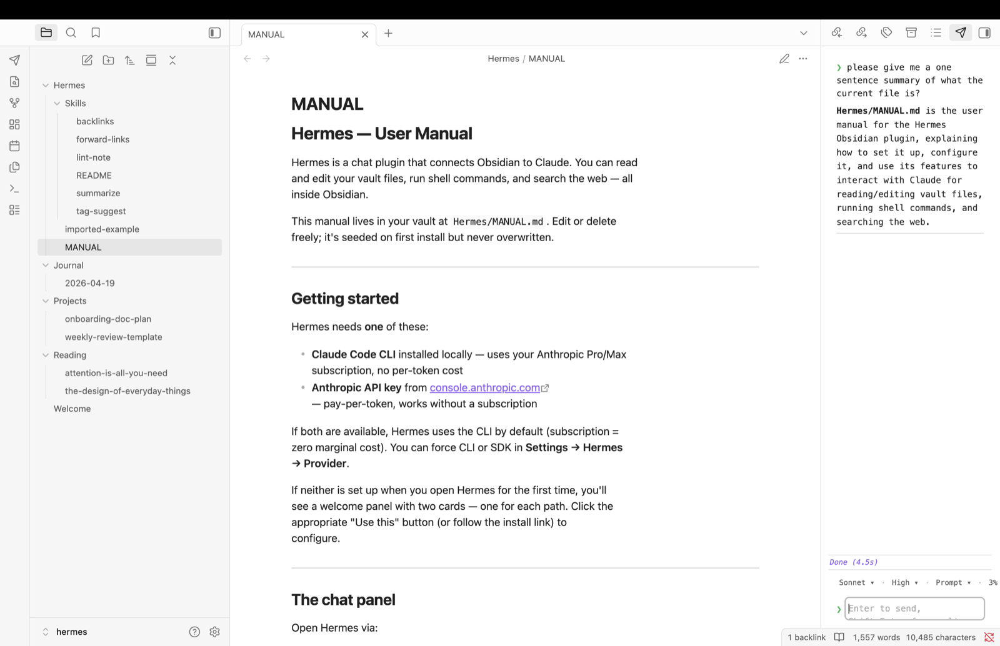
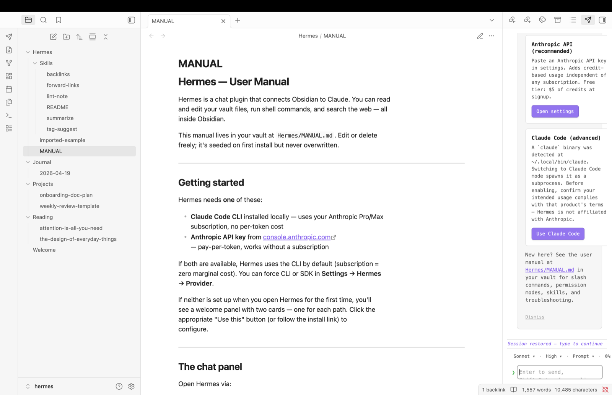
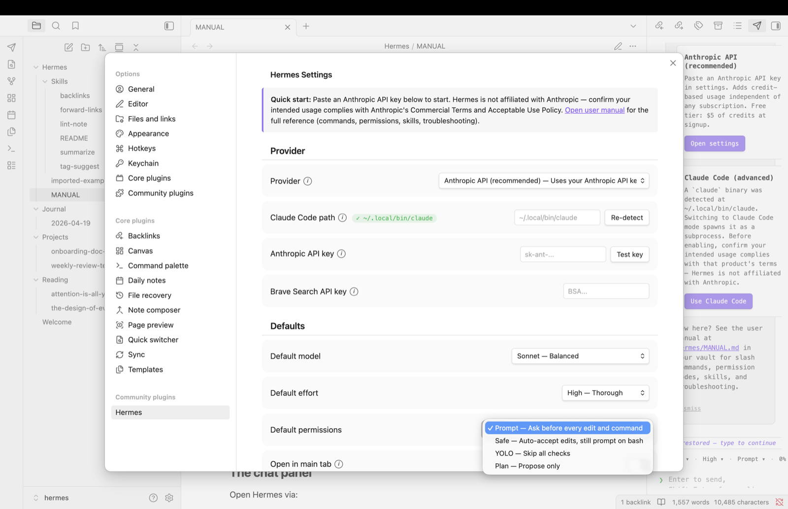
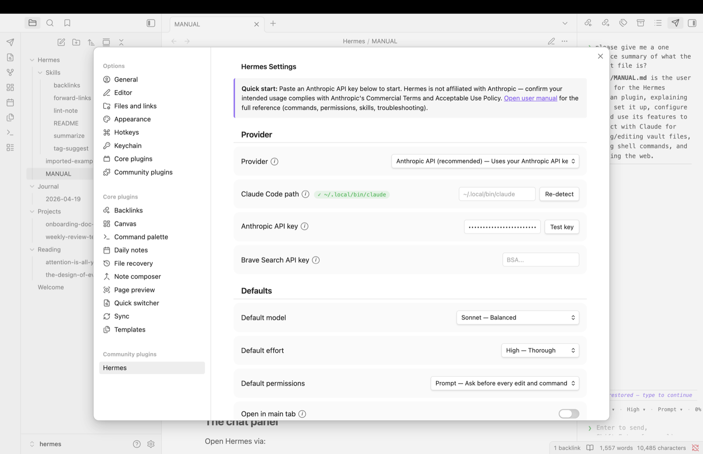
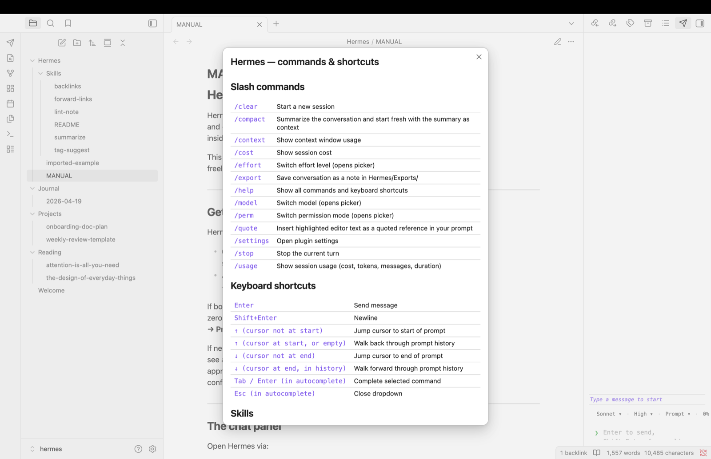

# Hermes

Claude chat for Obsidian. Talk to Claude, read and edit vault files, run tools — all inside Obsidian.

Hermes is a lightweight, reactive chat surface that connects your Obsidian vault to Claude via the Anthropic API. It runs on your local machine and reads/writes your vault files through a standard tool-use loop. Advanced users can optionally route chat through a locally-installed `claude` CLI as a subprocess instead of the API — enable that path only after confirming your intended usage complies with the CLI vendor's terms.

> Hermes is not affiliated with Anthropic. References to the Anthropic API in this README describe what the plugin talks to; they do not imply endorsement.

## Screenshots

| | |
|---|---|
|  |  |
| Chat panel with streaming response — note `Hermes/MANUAL.md` in the file tree, seeded on first install | First-run welcome panel adapts to what's detected (API key, local CLI, or neither) |
|  |  |
| Edit permission modal with diff preview | Settings tab — provider chooser, API key fields, defaults |
|  | |
| `/help` modal — slash commands, keyboard shortcuts, link to the in-vault manual | |

## Features

- **Built-in security layer** — a curated list of dangerous file paths (`.obsidian/`, `.git/`, `.claude/`, `.env`, ...) and commands (`rm -rf`, `Remove-Item -Recurse`, `curl | bash`, `format <drive>:`, `sudo`, registry mutation, ...) always surface an approval modal **even in YOLO mode**. Other Claude-for-Obsidian plugins defer entirely to Claude Code's permission modes — Hermes adds a dedicated guardrail so a one-word "yes" in YOLO can't wipe your vault. See **Built-in security** below for the full model.
- **Streaming chat panel** in a sidebar or main tab
- **Vault-native tooling** — Claude reads, writes, edits, searches, and runs shell commands with the vault as its working directory
- **Anthropic API by default** — connects to the Anthropic API directly. A Claude Code (local-CLI) mode is available as an advanced opt-in.
- **Permission modes** — Prompt, Safe (auto-accept edits), YOLO (skip all prompts), Plan (propose only). Independent of the built-in security layer above.
- **Approve-per-call modal** — every tool-use that matches one of your protected patterns surfaces in an Obsidian dialog with diff/command preview before it runs. Works in both Anthropic API mode and Claude Code mode on macOS, Linux, and Windows.
- **Untrusted-content framing** — web fetches, shell output, and out-of-vault reads are tagged when Claude sees them, so prompt injection in fetched content can't redirect the conversation
- **Per-file provenance** — files written from a web fetch are persistently flagged; subsequent reads show Claude the original source and treat the content as data, even after a plugin reload
- **Session persistence** — conversations survive plugin reloads, including full model context in Anthropic API mode
- **Skill loader** — `.md` files in `Hermes/Skills/` become slash commands; five skills ship pre-populated
- **Terminal-style input** — ↑/↓ jump cursor to start/end of prompt, or walk through prompt history
- **Slash commands** — `/clear`, `/compact`, `/context`, `/cost`, `/effort`, `/export`, `/model`, `/perm`, `/quote`, `/settings`, `/stop`, `/usage`

## Installation

**Via Obsidian's Community Plugins directory** — coming soon. Submission is queued for review; expect a 2–6 week window before Hermes appears in the in-app directory search.

**Via BRAT** *(recommended while directory review is pending)* — the [Beta Reviewers Auto-update Tool](https://github.com/TfTHacker/obsidian42-brat) is a community plugin that installs plugins directly from GitHub releases and keeps them up to date.

1. Install BRAT from Obsidian's Community Plugins directory (search for "BRAT").
2. Open **Settings → BRAT → Add Beta Plugin**.
3. Paste `polleoai/hermes` and click "Add Plugin". BRAT pulls the latest release.
4. Enable Hermes in **Settings → Community plugins**.
5. Future releases auto-update through BRAT.

**From source** *(for contributors)*:
1. Clone the repo into `{vault}/.obsidian/plugins/hermes/`
2. Run `npm install` and `npm run build`
3. In Obsidian → Settings → Community plugins → enable Hermes

## Requirements

- **Anthropic API key** from [console.anthropic.com](https://console.anthropic.com) — pay-per-token

Paste the key into **Settings → Hermes → Anthropic API key**. That's the default and only required setup.

Advanced users may optionally install a local `claude` CLI and switch **Settings → Hermes → Provider** to "Claude Code (advanced)" to spawn it as a subprocess instead of calling the API directly. Before using Claude Code mode, confirm your intended usage complies with that product's Commercial Terms and Acceptable Use Policy. Hermes is not affiliated with Anthropic and does not endorse any particular routing pattern.

## Provider modes

| Mode | How it works |
|---|---|
| **Anthropic API** (default, recommended) | Direct HTTP calls to `api.anthropic.com` via `@anthropic-ai/sdk`. Pay-per-token; straightforward billing relationship with Anthropic. |
| **Claude Code** (advanced) | Spawns a locally-installed `claude` binary as a subprocess and streams JSON over stdin/stdout. Requires confirming your usage complies with that product's terms. |
| **Auto** | Prefers Claude Code if the binary is detected, else falls back to Anthropic API. Opt-in; not the default. |

Anthropic API mode requires credits in your Anthropic workspace (Plans & Billing).

## Permission modes

Claude's ability to edit your files and run shell commands is gated by the Permission setting:

| Mode | Read tools | Normal edits | Normal shell | Protected path / command |
|---|---|---|---|---|
| **Prompt** (default) | Always allowed | Modal per file | Modal per command | Modal (always) |
| **Safe** | Always allowed | Auto-accept | Modal per command | **Modal (always)** |
| **YOLO** | Always allowed | Auto-accept | Auto-accept | **Modal (always)** |
| **Plan** | Always allowed | Refused | Refused | Refused |

Prompts include a preview: Edit shows old/new diff, Write shows the first 30 lines of content, Bash shows the full command with its working directory. You can tick "Remember for this session" to skip future prompts for the same file until plugin reload. Bash decisions are never cached — every command is asked individually.

All file operations are **vault-scoped**: paths like `../etc/passwd` are rejected before the tool runs, even in YOLO mode. Security boundary is `src/providers/anthropic-api/tools/path-utils.js`.

## Built-in security (what makes Hermes different)

Most Claude-for-Obsidian integrations rely entirely on the user's vigilance at each approval prompt plus Claude Code's own permission modes. Hermes adds a curated layer on top: a pre-populated list of known-dangerous **file-path patterns** (writes into `.obsidian/`, `.git/`, `.claude/`, `.env`) and **command patterns** (`rm -rf`, `Remove-Item -Recurse`, `curl | bash`, `iwr | iex`, `sudo`, `format <drive>:`, registry mutation, recursive chmod, etc.) that **always** surface an approval modal before running — including in YOLO mode.

The design choice: convenience modes (Safe, YOLO) silence prompts for _routine_ operations so Claude can iterate quickly; a separate rule set guards the _dangerous_ ones so you can't accidentally YOLO away your vault, your git history, or your shell. The two axes are independent.

Users stay in full control of the rule set:

- **Settings → Hermes → Security → Protect file paths / Protect commands**: per-feature master toggle if you want to rely on Claude Code's modes alone
- **Settings → Hermes → Security**: per-pattern checkboxes (default rules + your own additions) for fine-grained tuning
- Custom paths accept literal strings (trailing `/` = folder prefix); custom commands accept JavaScript regex

Every default pattern is listed with a user-readable "why this matters" tooltip so non-developers can decide whether to keep or uncheck it.

## Privacy and data flow

Hermes is local-first. The short version:

- **Your API key** lives in `{vault}/.obsidian/plugins/hermes/data.json` alongside other Obsidian plugin data. It is sent only as an `x-api-key` header to `api.anthropic.com` when Anthropic API mode is active. Never logged, never exported, never sent anywhere else.
- **Vault content** is sent to the Anthropic API (Anthropic API mode) or to the locally-installed `claude` subprocess (Claude Code mode) only when Claude invokes a Read/Grep/Glob/Write/Edit/Bash tool on your behalf during an active conversation. Outside an active turn, nothing leaves your machine.
- **Chat history** persists to `chat-history.json` in the plugin directory. In Claude Code mode, LLM turns also live in Claude Code's own `~/.claude/projects/<escaped-cwd>/<session-id>.jsonl` (owned by Claude Code, not Hermes — delete that file to rotate the Claude Code session).
- **No telemetry.** Hermes does not include analytics, crash reporting, or any opt-out-required data collection. There is no "phone home" path.
- **Diagnostics are opt-in.** **Settings → Hermes → Diagnostics → CLI debug logging** turns on console-side debug output and hook-invocation tracing. Everything it produces is console or local-file only; nothing is sent off-device. Default off.

What leaves your machine:

| Action | Destination | When |
|---|---|---|
| Chat message | `api.anthropic.com` (SDK) or local `claude` subprocess (CLI) | Per turn |
| Vault file read by Claude | Same as above, embedded in the turn | Only when Claude invokes a Read tool |
| WebFetch URL | The URL's origin (direct HTTP fetch) | Only when Claude invokes WebFetch |
| WebSearch query | `api.search.brave.com` (SDK with key) or Anthropic's built-in search (CLI) | Only when Claude invokes WebSearch |
| Everything else | Nowhere | Ever |

For vulnerability reports and the full data-handling breakdown, see [SECURITY.md](./SECURITY.md).

## Skills

A skill is a `.md` file in `{vault}/Hermes/Skills/` with YAML frontmatter:

```markdown
---
name: tag-suggest
description: Propose tags for the active note
argument-hint: "[optional: extra context]"
---
Read the active note and propose 3-5 tags that capture its core topics.
Tags should be lowercase-with-hyphens, avoid over-general terms, and
reference existing tags in the vault when possible.

{{args}}
```

Once saved, type `/tag-suggest` in Hermes chat to invoke it. `{{args}}` expands to anything typed after the skill name.

Pre-populated skills include `/tag-suggest`, `/backlinks`, `/forward-links`, `/summarize`, `/lint-note`. Delete them from `Hermes/Skills/` if you don't want them; they won't be re-created.

## Settings reference

| Setting | Purpose |
|---|---|
| **Provider** | Auto / Claude Code / Anthropic API (see Provider modes above) |
| **Claude Code path** | Path to `claude` binary. Leave blank for auto-detect. Used in Claude Code mode only. |
| **Anthropic API key** | For Anthropic API mode. Stored in `data.json`. Blank = check `ANTHROPIC_API_KEY` env var. |
| **Brave Search API key** | Enables WebSearch in Anthropic API mode. Free tier at [brave.com/search/api](https://brave.com/search/api/). Claude Code mode uses Anthropic's built-in search and ignores this. |
| **Default model** | Haiku / Sonnet / Opus / Opus 1M |
| **Default effort** | Low / Medium / High |
| **Permissions** | Prompt / Safe / YOLO / Plan (see Permission modes above) |
| **Open in main tab** | Opens chat in main editor area instead of sidebar |

## Keyboard shortcuts

| Key | Action |
|---|---|
| **Enter** | Send message |
| **Shift+Enter** | Newline |
| **↑** (cursor not at start) | Jump cursor to start of prompt |
| **↑** (cursor at start) | Walk back through prompt history |
| **↓** (cursor not at end) | Jump cursor to end of prompt |
| **↓** (cursor at end, in history) | Walk forward through prompt history |
| **Tab / Enter** in autocomplete | Complete selected command |
| **Esc** in autocomplete | Close dropdown |

## Architecture

Hermes is structured around a pluggable provider interface:

```
src/
├── plugin.js                    — Obsidian plugin entry + settings UI
├── chat-view.js                 — streaming chat UI
├── constants.js                 — slash commands, models, permission modes
├── skills.js                    — skill file loader + dynamic slash commands
├── bundled-skills.js            — pre-populated skill content
├── utils.js                     — shared helpers
└── providers/
    ├── provider-interface.js    — contract doc (JSDoc-only)
    ├── factory.js               — selects CLI or SDK based on settings
    ├── cli/
    │   └── claude-code-cli.js   — subprocess wrapper for the local `claude` CLI
    └── sdk/
        ├── anthropic-sdk.js     — direct API client (streaming, history-aware)
        ├── tool-loop.js         — multi-turn tool-use driver
        └── tools/
            ├── path-utils.js    — vault-scoped path validation
            ├── tool-registry.js — schemas + dispatcher
            ├── read.js
            ├── glob.js
            ├── grep.js
            ├── write.js
            ├── edit.js
            ├── web-fetch.js
            ├── web-search.js
            ├── bash.js
            └── permission-gate.js
```

The provider-interface documents the contract every backend implements — one `send(prompt)` method, streaming callbacks, and read-only properties (resolvedModel, contextTokens, sessionId). Adding a new provider (OpenAI-compatible, Gemini, Ollama, etc.) means implementing that interface and adding a branch in `factory.js`.

## Development

```bash
npm install              # install SDK + esbuild
npm run build            # bundle plugin → main.js at repo root
npm run dev              # watch mode (rebuilds on every save)
```

### Live install into a test vault

Set `HERMES_VAULT` to your vault root (comma-separate multiple vaults) and every build pushes `main.js`, `manifest.json`, `styles.css` into `<vault>/.obsidian/plugins/hermes/` automatically:

```bash
HERMES_VAULT=/path/to/my-vault npm run dev
```

Enable Hermes once in Obsidian so the plugin folder exists, then reload Obsidian (Cmd+R / Ctrl+R) after each edit to pick up fresh bytes. If `HERMES_VAULT` is unset, builds go only to the repo root and you copy manually.

## Multi-instance notes

If you run **two Obsidian windows pointing at the same vault** (a rare but possible setup — e.g. launching Obsidian with `open -n -a Obsidian` on macOS), each window has its own Hermes plugin instance:

| Shared across instances | Isolated per instance |
|---|---|
| `provenance.json`, `chat-history.json`, `data.json` in the plugin dir | IPC socket (`hermes-<pid>-<hex>.sock`), session flags, CC subprocess |

**What works correctly:**
- Each instance talks to its own local-CLI subprocess via its own socket. No cross-talk between CLI sessions.
- Hook scripts find the right plugin because the spawn env var points to the owning plugin's socket.
- Orphan-file cleanup respects live-pid semantics — one instance never unlinks files an active sibling might still be using.

**Known limitation — provenance tag race:**
- Two instances concurrently writing `provenance.json` can clobber each other. Hermes mitigates by reloading the disk state at the start of every mutation, shrinking the race window to microseconds, but doesn't eliminate it.
- **Consequence of a lost tag:** one file won't be flagged untrusted on reads until the next tag-producing operation re-tags it. Recoverable.
- **Planned mitigation:** advisory lockfile around mutations for bulletproof atomicity.

**Known limitation — chat history:**
- `chat-history.json` is a single shared file and each instance saves its own view. One instance's save can overwrite the other's recent messages. Fix is outside Hermes's current scope.

For most users running a single Obsidian window, none of this matters. If you do run multiple windows on the same vault, prefer opening separate *chat sessions* in separate windows rather than interleaving messages across windows.

## License

MIT © POLLEO.AI.

## Contributing

Contributions welcome once the repository is public. For now, open issues or discussion threads in the parent repository.
